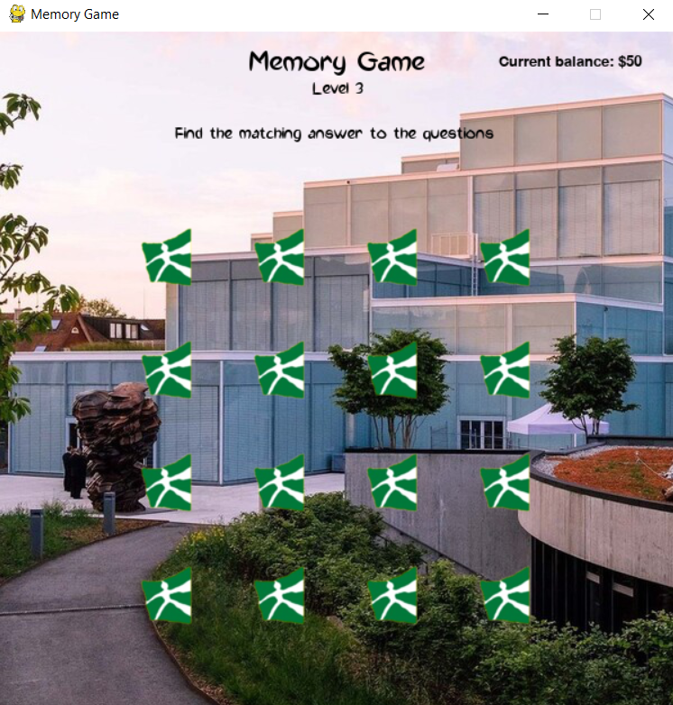
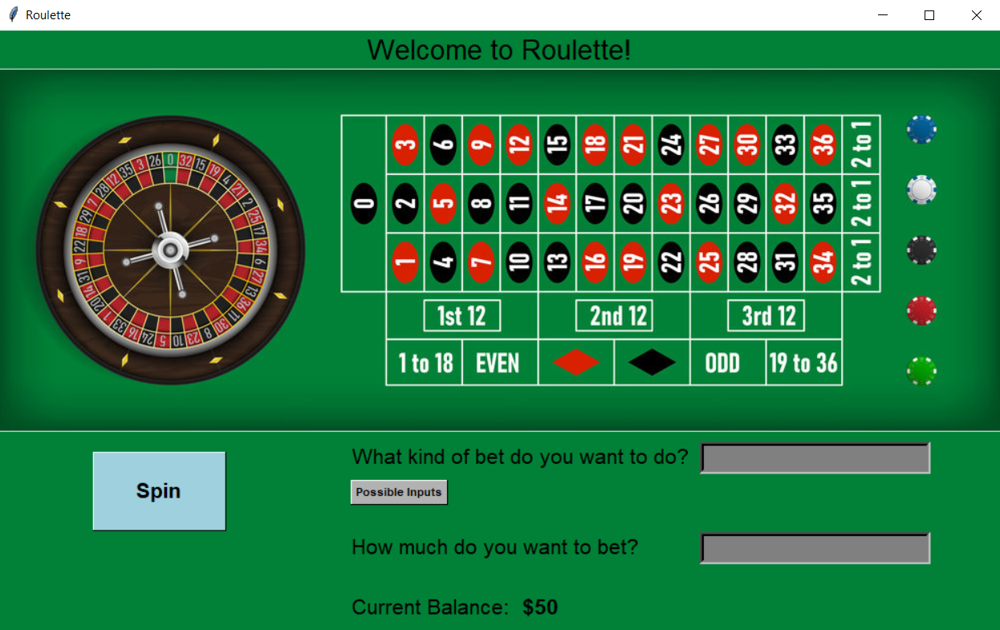
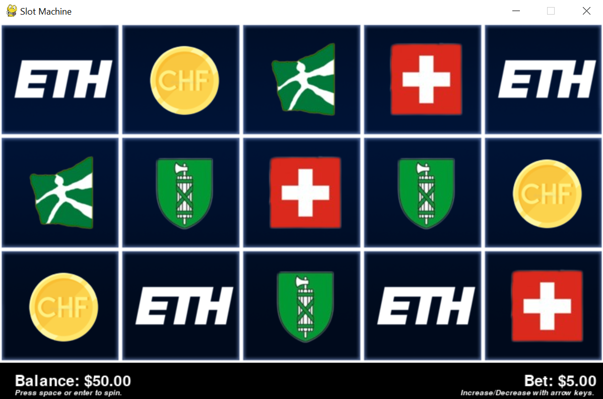
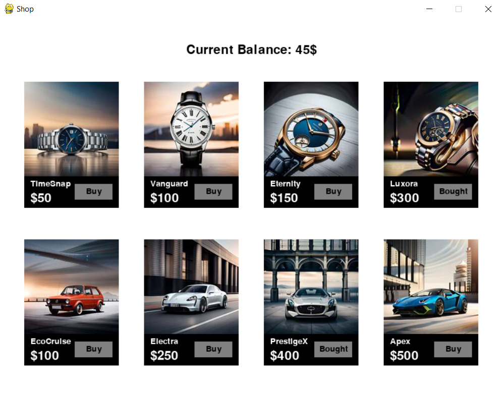
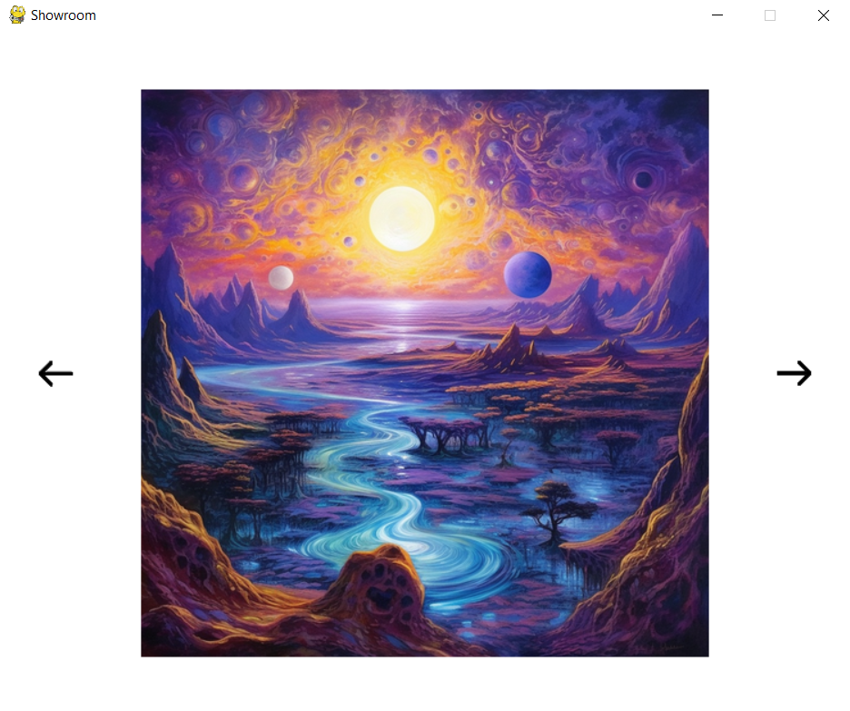
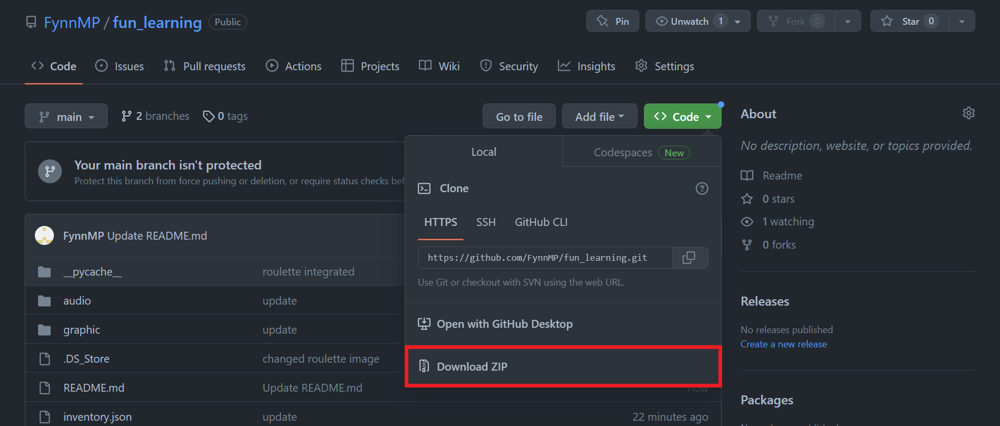

# LEARNxCASINO - Learn Hard, Play Hard!

Welcome to our innovative learning platform. With this program you can study fundamental concepts of the St. Galler Management Modell as well as basic corporate finance principles. Your hard-earned money can be used to buy watches, cars, boats and art in the shop. If you are a rather risk loving person you can try multiplying your money in our casino. Don´t forget to check out your treasures in the showroom. Have fun and best of luck!

Menu                                                    |  SGMM / finance memory                              |  Roulette           
:------------------------------------------------------:|:------------------------------------------------------:|:------------------------------------------------------:
         |       |  

Slot machine                                            |  Shop                                                  |  Showroom           
:------------------------------------------------------:|:------------------------------------------------------:|:------------------------------------------------------:
         |         | 

Once you have bought items you do not have to worry about losing them once you close the menu. Your earned money as well as any bought items are saved and will be available for you once you decide to continue studying with our project. 

# How to run
Download a zip file of our project via the green button on the top right.  
 

2. Locally unpack the zip file on your computer.
3. Open the unpacked folder in VS Code or another IDE.
4. Open the file "menu.py" and run it. 
5. Finally: Learn Hard, Play Hard!

If you are using two screens and find that the menu or game window is not fully visible on one screen, you can try moving it to the other screen.

# Debug
If you have any problem running the project please make sure that you have all the necessary libraries installed. Namely, those are: 
1. tkinter
2. pygame
3. subprocess 
4. sys
5. json
6. random
7. os
8. ctypes

Apart from pygame and tkinter the libraries should be already installed by default with the latest version of python. To install the needed libraries use the terminal and the "pip install {packagename}" command. 
Also do not manually change the data structure of the json files. Otherwise the interprogram money and inventory logic might break down. To have earned money and bought items available after closing the menu, make sure that you do not clone or download the whole project again, since your progress is only saved locally.  

# Ideation
We embarked on a mission to make learning more engaging and digitally immersive by combining it with the excitement of casino games. As four students we have experienced the exhaustion of studying for countless exams and thus thought about a solution. Our project aims to revolutionize education by providing a platform where learning and fun seamlessly intertwine.

# Group Participants
Armel Gyres Wetchoko, Julian Carlen, Raul Stillhart and Fynn Pohl 
 
 
 
 
 
 
 
***Disclaimer:*** The logos used in this project are solely intended for educational purposes and are not to be distributed, reproduced, or used for any monetary gain. The inclusion of these does not imply any endorsement or affiliation with the respective organizations or entities. This project is not an official product of the University of St. Gallen, nor does it represent the views or opinions of its faculty, staff, or students. The sole purpose of this project is to provide educational content and does not imply any association or endorsement by the University of St. Gallen or its affiliated individuals. Furthermore, it should not serve in any way as an incitement to gamble. 
Gambling can be addictive and should be handled with caution. 
